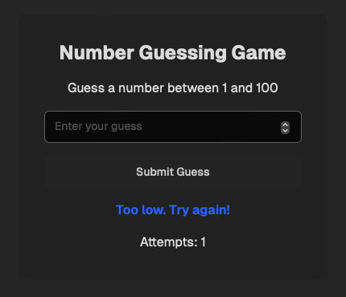

# Week 3 Assignment
#### Description
Using V0, I created an app that prompots the user to enter a number between 1 and 100, and then has the user keep guessing numbers with feedback after each try until they get the number right.
#### Output
Below are an example outputs:

    

    

#### Notes

Working with .tsx files, I learned that these files are primarily designed for use in environments that can render JSX, typically through a framework like React or Next.js. They aren't intended to be run directly like scripts but need a runtime environment capable of interpreting the JSX syntax.
###### Key Takeaways:
- .tsx files are TypeScript files that support JSX, making them ideal for developing React components.
- Running a .tsx file directly with tools like ts-node doesn't work well, since it lacks the necessary rendering context. Instead, a framework such as Next.js should be used to properly compile and serve these files.
- To run .tsx files effectively, I used Next.js to create a page, allowing me to see the rendered output in the browser, which is the natural context for .tsx components.
###### Ease of Making a New Program Using Next.js v0
- I found it surprisingly easy to set up and start a new project using Next.js v0. The framework provides a seamless development environment where:
- Creating a new page is as simple as adding a .tsx file in the appropriate directory (such as pages or app).
- The built-in development server makes it easy to quickly see changes in the browser, providing instant feedback while building the app.
- The out-of-the-box support for TypeScript means that type safety is ensured throughout the project, which is very helpful for avoiding bugs.

Overall, working with .tsx in Next.js is efficient, and using Next.js’s development tools makes the process of developing new React-based applications straightforward. The experience demonstrated how modern frameworks like Next.js streamline creating interactive user interfaces without a complex configuration.