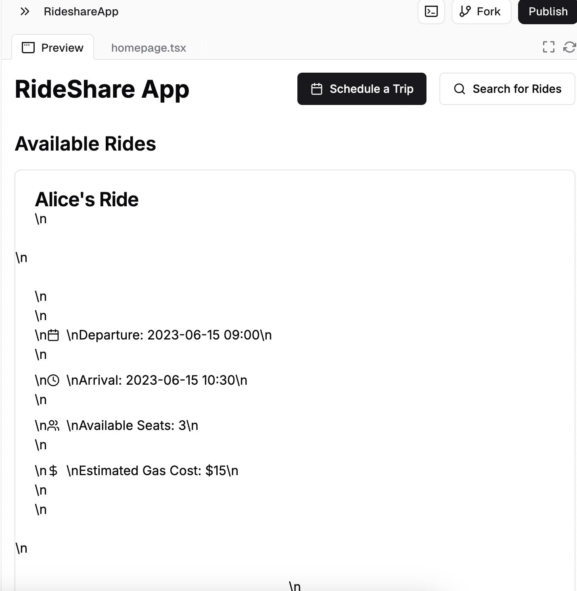
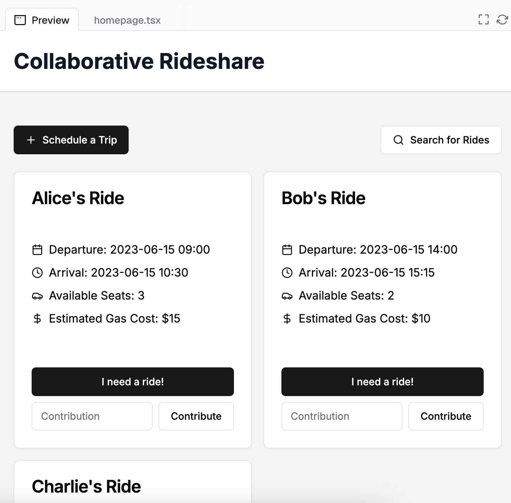
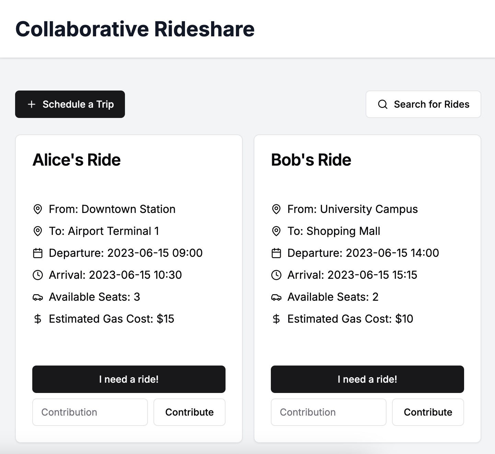

My prompt: 
Generate homepage in NextJS/TypeScript for a collaborative rideshare app. Users with vehicles can schedule the times that they intend to leave, as well as how many available seats are in their vehicle, and an estimated arrival time, and post them to allow their contacts on the site to see them.  Users can then press a button that says "I need a ride!" if they would like to be a passenger in that car. Each ride should, in addition to its scheduled departure and estimated arrival, should have the estimated price for the gas required to make the trip, with a button that allows users to contribute some or all of the gas price in return for the ride.  There should be easily accessible buttons to "schedule a trip" and to "search for rides". 

Original output: 

this output pretty clearly had something go wrong on the back end, so I decided to run it again to see if I got a better result (which I did). 

Second output: 

Next, I asked the AI to add in start and end locations to the cards that appear on the homepage. 

Third output:

Learning experience notes: 

The first thing I learned is that results can be unreliable - as seen in my first and second attempts, results can be drastically different, even with the exact same input. Therefore, it's a good idea to seperate out different steps of the process of building an application and save at each stage, so that if there are undesirable results one can go back and try again, tweaking the prompt as needed. It's also easy to add features, so it's worth the effort to break the code up so it starts with a simple stage that provides a good base to add more complex features onto in such a way that they can be edited by hand or written through AI multiple times for the best results. It seems to me that the AI is really good at working out the broad strokes of a project, like creating different tiles to represent posts on the site. 