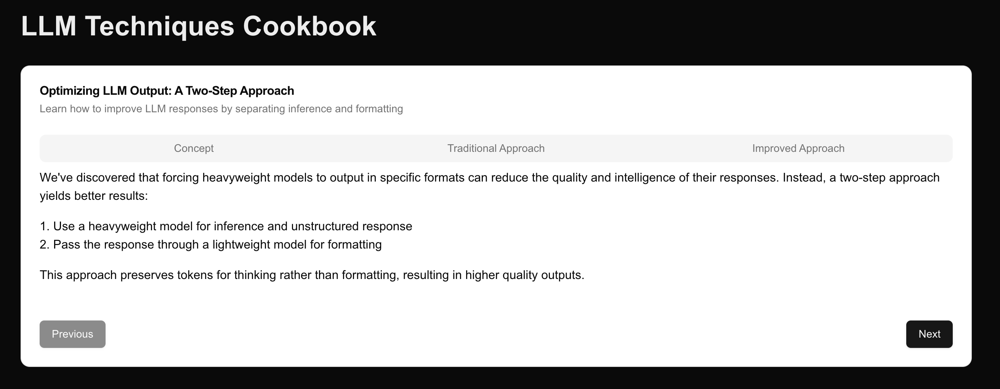
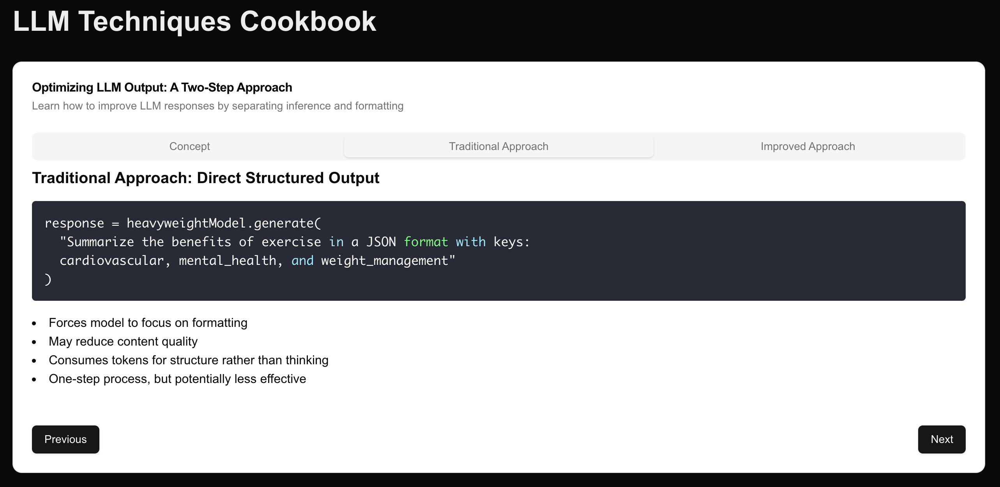
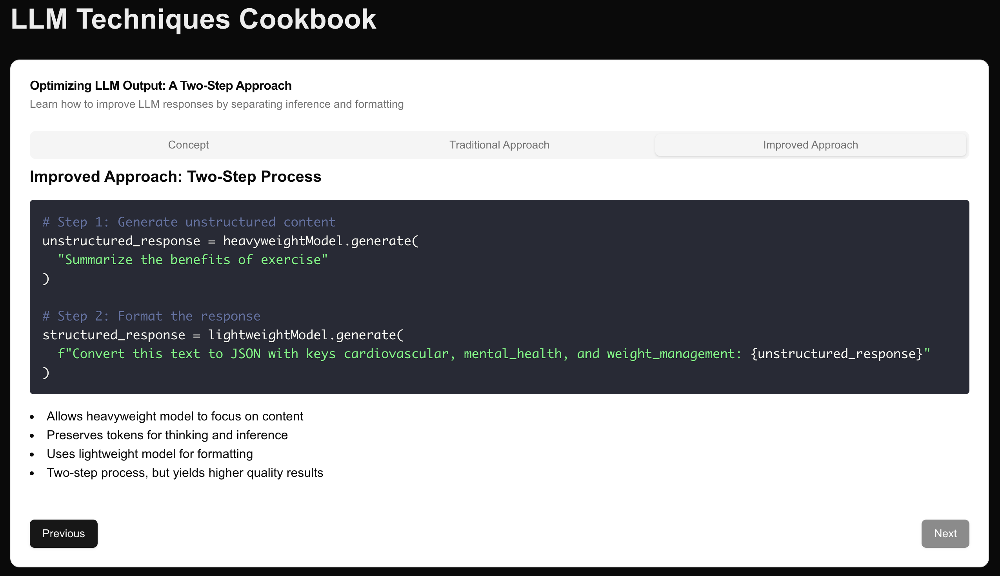

# Experimental Conversation Report - Version 0 (V0 Dev)

## Summary

This conversation centers around creating a **static website using Next.js** that serves as a **cookbook** for different techniques learned with **large language models (LLMs)**. The main idea discussed involves an **improved approach** for handling model outputs by separating inference and formatting tasks between different models. The conversation also covers implementation, code structure, UI components, and error handling for this cookbook.

---

## 1. Initial Prompt

_"Make a static website using Next.js which will be a cookbook on LLM techniques I've learned so far. Right now, let's include the idea that using models and converging their output to defined types has shown to reduce the quality and intelligence of the response. Instead, I've found better results by having the heavyweight intelligent model do the inference and respond in regular format, so we save the tokens for thinking and not formatting. Then, run the response through another lightweight LLM like 4o-mini or llama-8b to format the response using structured outputs to have an object we can work with in code. Make this cookbook informative, use coding examples visually to show the difference and make it easy to follow."_

---

## 2. Goal

The goal was to create a **Next.js-based static website** to explain an improved approach for handling LLM outputs. The improved method leverages one model for inference and a second, lighter model for formatting, optimizing the use of tokens by separating "thinking" from "formatting."

## 3. Approach Breakdown

- **Traditional Approach**: The LLM generates structured outputs, which can degrade the response's quality.
- **Improved Approach**: A more intelligent model handles inference, while a lightweight model formats the response. This separation increases efficiency by focusing resources on thinking rather than formatting.

## 4. Website Structure

The static website contains the following elements:

- **Main Page**: Explains the concept, traditional approach, and improved approach.
- **Components**:
  - `CodeBlock.tsx`: Displays code snippets.
  - `ComparisonBlock.tsx`: Visually compares the two methods.
  - **Tabs and Stepper navigation**: Users can switch between explanations of different approaches.

### Example Screenshot of Main Page



---

## 5. Challenges Encountered

- **Error Encountered**: `CodeBlock is not defined` was caused by missing imports and component definitions.
  - The solution was to move `CodeBlock` into its own file and properly import it in `index.tsx`.
  - The project structure was updated to include these files in a clear, organized manner.

### Screenshot of Error Resolution



---

## 6. Additional Features v0 Suggested

- **Tabs and Stepper Navigation**: Allows users to toggle between different sections explaining each LLM technique.
- **Comparison Block**: Displays the differences in code output and approach performance side-by-side.
- **Code Examples with Bullet Points**: Step-by-step learning is achieved through combining code snippets with bullet points in a clean UI.

### Screenshot of the Stepper with Bullet Points



---

## 7. Outcome

After completing the conversation with **v0**, I was able to run a single `npm` command to clone the project into this repository. Following that, I executed the install command and started the development server. The result looked exactly as shown in the screenshot from the conversation, which is included in the **llm-cookbook** folder.

Here is the command I ran from v0:

```
npx shadcn@latest add "https://v0.dev/chat/b/b_9Tr6Tgr?token=eyJhbGciOiJkaXIiLCJlbmMiOiJBMjU2R0NNIn0..bzMU-gZybXs21JPq._rgUJVEzooyi1jkQzvZfeLaQMswOfELKAyeU5E2tJw6b-XNCMXSWQw.jdnxt513MvmS7RtZucirlg"
```

---

## 8. Future Enhancements

Suggestions were made to enhance the cookbook further:

- Add more techniques with corresponding pages.
- Include real-world case studies that highlight the effectiveness of the improved approach.
- Add interactive elements, such as text input/output examples to showcase the comparison between the two methods in real-time.

## 9. Week 5 Updates

In Week 5, I made several enhancements to our LLM Cookbook project:

### 9.1 Quiz Addition

I've added an interactive quiz component to reinforce learning:

- Implemented using shadcn components for a consistent UI
- Includes a multiple-choice question about LLM approaches
- Provides immediate feedback on user answers

### 9.2 Enhanced Interactivity

The quiz feature adds a new layer of engagement:

- Users can test their understanding of the presented concepts
- Immediate feedback helps solidify learning

### 9.3 Code Changes

Key modifications to the `pages-index.tsx` file:

- Added new state variables for quiz answer and result display
- Imported additional shadcn components (RadioGroup, Alert, etc.)
- Created a new Card component for the quiz section
- Implemented logic for answer submission and feedback display

### 9.4 Future Considerations

Potential next steps for the project:

- Expand the quiz with more questions covering different LLM techniques
- Implement a scoring system for multiple questions
- Add explanations for both correct and incorrect answers to deepen understanding

These updates align with the goal of creating an informative and interactive cookbook for LLM techniques, further improving the learning experience for users.

### 9.5 New Quiz Feature Visualization

I've added a visual representation of our new quiz feature:


This image showcases the implementation of the quiz using shadcn components, demonstrating how I've integrated interactive learning elements into our LLM Cookbook.
